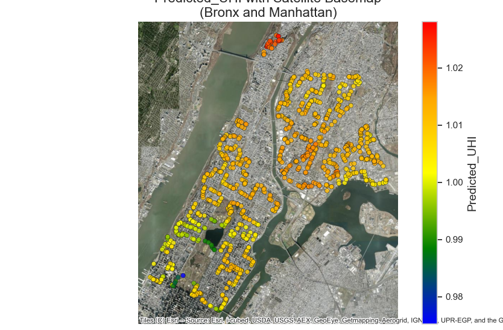

# UHI Project

## Project Description
Throughout this project, I teamed up with @Max Tsvayner where our task was to predict Urban Heat Island Index values using weather and satellite data. We built a random forest regression model that achieved an R² score of 0.9105, effectively capturing patterns in urban heat distribution. One of the best parts was visualizing our result on a geospatial heat-map, highlighting the-risk areas in the Bronx and Manhattan.

## Heat Map


## Installation

1. **Clone the Repository**  
   ```bash
2. **Install the Dependencies**
    ```bash
    pip install -r requirements.txt

3. **Run the create_submission.py**

